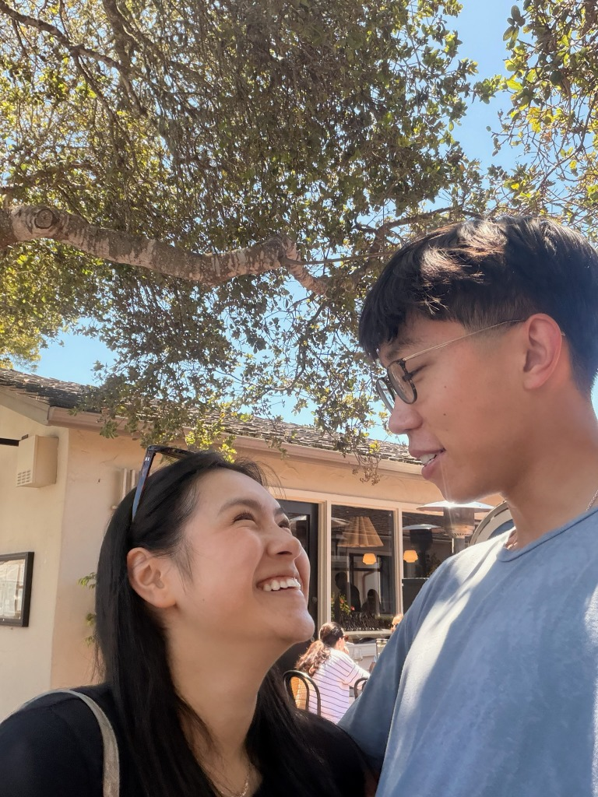

# 🌹 National Couples Day Page for Joanne

A romantic, interactive, and mobile-responsive website created for **Joanne** on National Couples Day.

## 🚀 Live URLs

Once pushed to GitHub, this page will be immediately live at:
- **`https://dylangtsao.com/joanne/`** (or `https://dylangtsao.github.io/joanne/`)

---

## 🎨 How to Customize

### 1. Adding Real Photos
Inside [`joanne/index.html`](file:///Users/dylangtsao/Documents/GitHub/dylangtsao.github.io/joanne/index.html):
- Place your photo files in a folder like `joanne/images/photo1.jpg`.
- Replace the `<svg>` blocks inside `<div class="polaroid-img-wrapper">` with standard images:
  ```html
  <div class="polaroid-img-wrapper">
    
  </div>
  ```

### 2. Customizing the Anniversary Date
In [`joanne/index.html`](file:///Users/dylangtsao/Documents/GitHub/dylangtsao.github.io/joanne/index.html#L170), find:
```html
<div class="milestone-box" id="love-counter" data-start-date="2024-08-18T00:00:00">
```
Change `2024-08-18T00:00:00` to the actual date you two started dating!

### 3. Editing the Love Letter
In [`joanne/index.html`](file:///Users/dylangtsao/Documents/GitHub/dylangtsao.github.io/joanne/index.html#L69-L86), you can customize the letter text with your own personal memories or inside jokes.

---

## 🚢 Deployment via GitHub

Run the following commands in your terminal to deploy:
```bash
git add joanne/
git commit -m "Add National Couples Day page for Joanne ❤️"
git push origin master
```
GitHub Pages will automatically build and publish it within ~30–60 seconds!
